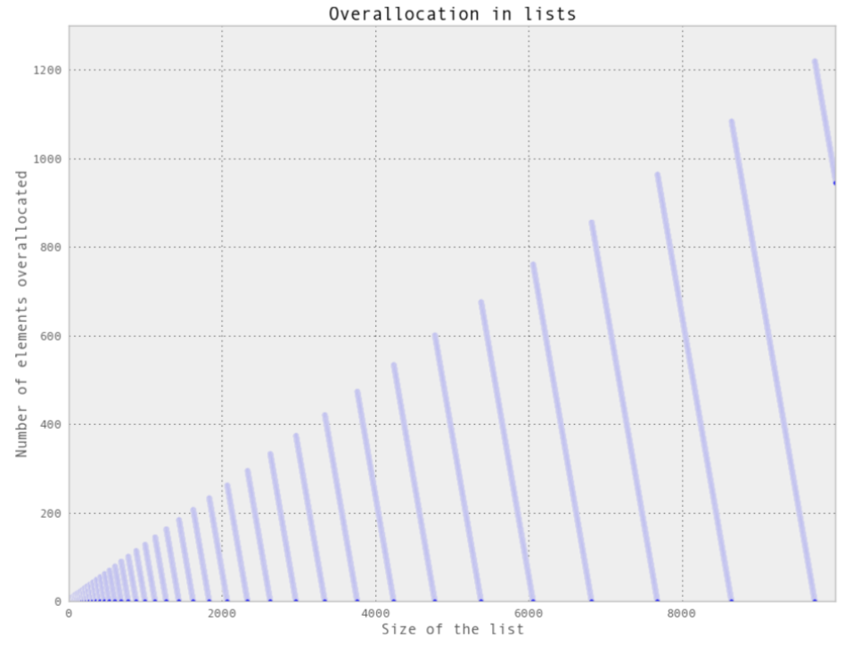

One of the most important things in writing any performant program is understanding the guarantees of data-structure of the language. Python is gread at abstracting the low-level details of data-structure which allows developer to focus on prototyping. However, there comes a time where it is important to understand abstractions used to remove bottlenecks and optimize the code. This article will provide high-level summary on how commonly used data-structures such as list, tuple, Dictionary and Sets are handled and some areas for optimization.

### List and Tuples

List and tuples fall under class of Array, which is a flat list with some intrinsic ordering. An element can be accessed with O(1) if the relative position is known. If not then various searching algorithms have to be used for efficient element retrival.

In Python, list are dynamic and mutable, tuples are static and immutable. Memory can be viewed as contigious buckets with ordering in addresses. An array starts at an address X and elements can be accessed by using an offset value which is reffered to as index. The conversion of logical address to physical address is handled by the MMU.

Lists are dynamic, which means the array can be resized once it becomes full to add additional elements. The larger the list, the larger the new resized list. Resizing and copying elements is an O(N) operation and can stagnate your application. Diagram above shows the size of list and the elements increase.

Tuples are cached by Python's runtime which means the application does not need to talk to kernel to reserve memory everytime we need to use one. For tuples size 1-20, when they are no longer used the data is discarded but the allocated memory is not given back to the OS. This means during the runtime another tuple can be initialized and use the cached memory. This would save time from talking to the OS.

### Dictionary and Sets

Dictionaries and sets are implemented using hash tables which have O(1) lookups and insertions. This is achieved using clever hash functions to turn arbirtary key into index of a list. There are four components to a hash table are insertion, retrieval, deletion and resizing.

#### Insertion and retrieval

Insertion and retrival requires conversion of element into an index value through the hash function. The effectiveness of the function is determined by the how well the data is spread and how the value compare with each other. This is mathimatically represented using Entropy. Usually, the key is hashed and a mask is applied to determine appropriate index value. As the size of the map increases the mask gets smaller. If a collision occurs, then two options are to use a linked list or use a probe method. Same process goes for retrival.

#### Deletion and resizing

When element is removed, add a sentinel such as Null as a place holder. When the table becomes large, it needs to be resized and previous elements have to be adjusted. It is shown that table with no more than two-thirds full will have optimal saving.

#### What to watch out for

By default, the smallest size of a dictionary or set is 8 (that is, if you are only storing three values, Python will still allocate eight elements). On resize, the number of buckets increases by 4x until we reach 50,000 elements, after which the size is increased by 2x. This gives the following possible sizes:  8, 32, 128, 512, 2048, 8192, 32768, 131072,262144.

### Conclusion

Python is an excellent language for rapid-prototyping production application. However, to be able to resolve bottlenecks it is vital to understand the guarantees of datastructure. One should know when to use lists and tuples and their performance tradeoffs.

#### References

Micha Gorelick, Ian Ozsvald - High Performance Python_ Practical Performant Programming for Humans-O'Reilly Media (2014)
