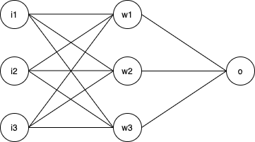

Word2Vec is developed by google and is a technique that creates vector representation for a word in a corpus which is extremely useful for many natural-language-processing (NLP) tasks.

This article will focus on the first step, which is building a feedforward neural network.

There are three parts into building a feedforward neural network, the initialization of neural network, feedforward and backpropagation algorithm.

The code will look like this
```python
import numpy as np
class NeuralNetwork():`

    def __init__(self):
        pass

    def train(self):
        pass

    def query(self):
        pass
```


## Initialization
We will be building this network 


The shape of the input: (# of input variable, number of inputs)
The shape of weights connecting layer1 and layer 2 (# of nodes in next layer, # of nodes in current layer)

From the network graph, the shape is
Input: (3 , n)
hidden layer: (3 , 3)
output layer: (1 , 3)

##### Initializing weights

Now that we know the shape of the weight matrix, now assign random weights
The initializing function takes number of input nodes, number of hidden nodes and number of output node and learning rate.
```python
def __init__(self, n_input_node, n_hidden_node, n_output_node, lr = 0.1):
    self.lr = lr
    self.weight_input_hidden = np.random.randn(n_hidden_node, n_input_node)
    self.weight_hidden_output = np.random.randn(n_output_node, n_hidden_node)

```


## Forward pass
Each value at a given node is multiplied by the weight of wire connecting to the next layer.

The next layer receives and sums the input signal from preceding layer and applies the activation function.

In order to train the network, the input needs to be propagated to the output. Then the difference is compared to the targeted output.

```javascript
function(x){
    console.log(x)
}
```


```python
def train(self, input_list):
    """
        Input: list of input value [[i0, i1, i2], ...n]
        Needs to be transformed to (3 , n) matrix

    """
    # forward pass
    input_matrix = np.array(input_list, ndmin=2).T

    net_hidden = self.dot(self.weight_input_hidden, input_matrix)
    out_hidden = self.activation_function(net_hidden)

    net_output = self.dot(self.weight_hidden_output, out_hidden)
    out_output = self.activation_function()

    #forward pass complete
```

## Back propagation
Backpropagation algorithm is the heart of neural networks.
Algorithm for back propagation

* First, distribute the error to the previous layer. This is achieved why distributing the error proportionally with respect to the input weight.

* Next, calculate the change in error with respect to each incoming weight.

$$
\delta w1 = \partial w1 / \partial E
$$

* The partial differentiation is to be expanded using chain rule

$$
    \partial w1 / \partial E = \partial E / \partial out * \partial out / \partial net * \partial net / \partial w1
$$
$$
net = \sum w_i j_i
$$

$$
\partial net / \partial w1 = i_k
$$
$$
out = sigmoid(net)
$$

$$
\partial out / \partial net = sigmoid(net) * (1 - sigmoid(net))
$$
$$
\partial E / \partial out = target - out
$$

putting it together

$$
\partial E / \partial w1 = (target - out) * sigmoid(net) * (1 - sigmoid(net)) * ik
$$

The train function with back propogation becomes


```python

def train(self, input_list, target):
    input_matrix = np.array(input_list, ndmin=2).T
    target_matrix = np.zeros((self.o, 1))
    target_matrix[target] = 1

    net_hidden = self.dot(self.weight_input_hidden, input_matrix)
    out_hidden = self.activation_function(net_hidden)

    net_output = self.dot(self.weight_hidden_output, out_hidden)
    out_output = self.activation_function()
    
    error = target_matrix - out_output # 10, 1
    
    hidden_output_error = np.dot(self.weight_hidden_output.T, error)
    self.weight_hidden_output += self.lr * np.dot((error * out_o * (1 - out_o)), np.transpose(out_h3))
    
    input_hidden_error = np.dot(self.weight_input_hidden.T, hidden_output_error)
    self.weight_input_hidden += self.lr * np.dot((h3_e * out_h3 * (1 - out_h3)), np.transpose(out_h2))
```

This covers the bulk of reviewing feed-forward neural network. Now we are ready to build a word-to-vec model from scratch.

