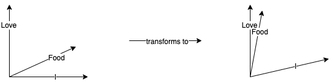
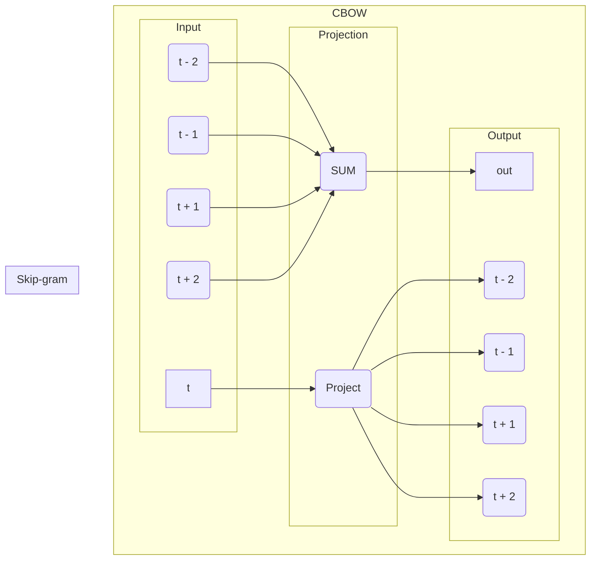
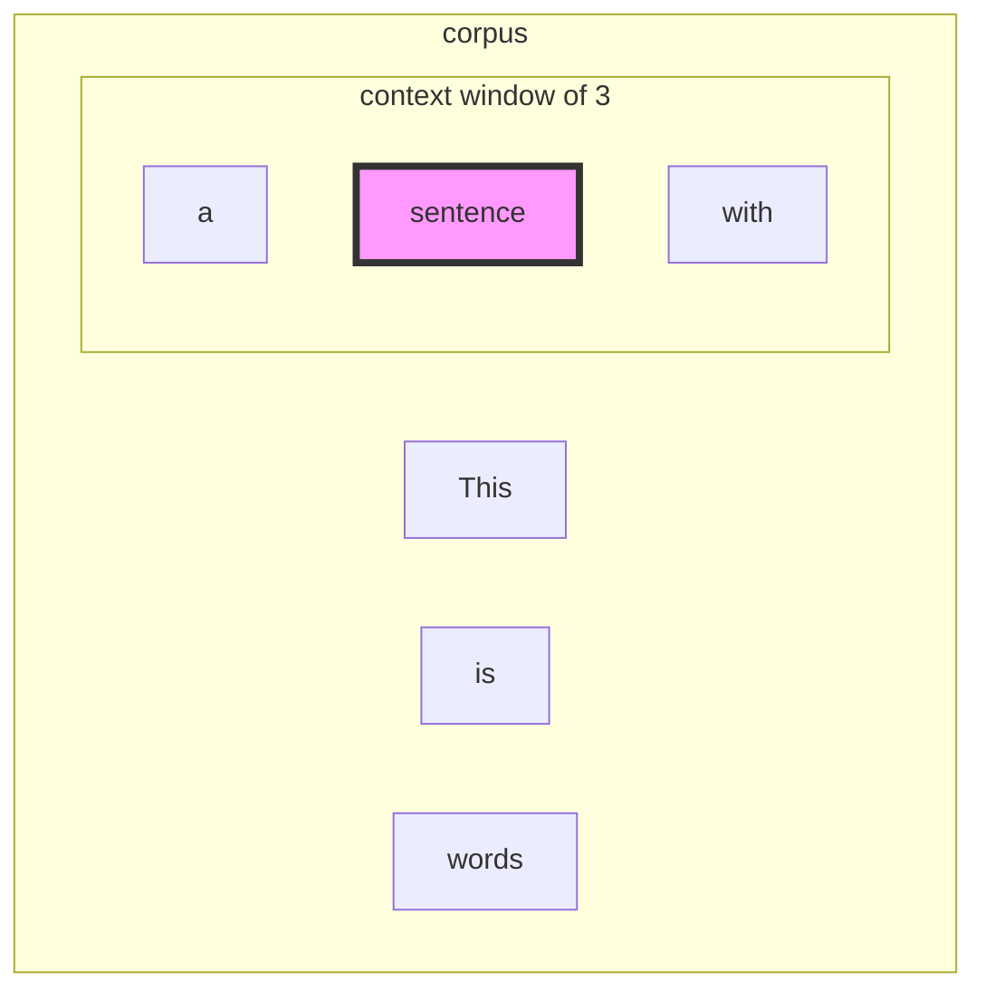

Part one of this article is a speedy re-introduction into feedforward neural network. Word2Vec is a group of models which are used to produce word embedding. Word embedding is a term used to describe the mapping of words to a vector to facilitate mathematical operations which yeild interesting features of the data.

### Word embedding intuition
Lets say our large imaginary corpus contains only three unique words **"I"**, **"Love"**, **"Food"**. Each word will be represented using a one-hot vector with shape (3,1) since there are only thee unique words.


$$ 
\text{I} =  \begin{bmatrix} 1 \\ 0 \\ 0 \end{bmatrix} 
$$

$$ 
\text{Love} =  \begin{bmatrix} 0 \\ 1 \\ 0 \end{bmatrix} 
$$

$$ 
\text{Food} =  \begin{bmatrix} 0 \\ 0 \\ 1 \end{bmatrix} 
$$

In our imaginary dataset, the words **"Love"** and **"Food"** co-occur together multiple times which means the model creates a vector representation of **"Love"** and **"Food"** such that the **distance** between the vector is less than other words.

The **distance** can be determined in differnt ways, the most common method is the **cosine similarity** which calculates the cosine of two vectors in high dimension. If the vectors are similiar then cosine similiarity is close to one.

<center>



</center>

The figure above illustrates a hypothetical transformation of input vector such that the **"Love"** and **"Food"** vector are close together. Note that the transformed vector is usually in much higher dimensions than the input vector.


### Word2Vec variations

Word2Vec is an unsupervised approach in generating embeddings by using the training data itself to guide embedding generation. There are two variation of Word2vec, skip-gram model and Continous-bag-of-word (CBOW) model. The skip-gram model takes a context word and predicts "neighboring words" in the vector space, whereas the CBOW model takes group of words and predicts the context word. Both approach are congruent. This article will explore skip-gram in depth

<center>



</center>

#### Model overview

In skip-gram model, we want to give the model a "context word" and it will try to predict "target word" which would occur in the **context window**. The context window is a hyper parameter which tells the model that words which occur within this window are related to the context word.


The first layer in the neural network is called the word-embedding layer. The shape of this layer is dependant on the number of unique words in the corpus. The second layer is known as dense layer which determines the shape of the output vector.

##### training
First, the words in the corpus are tokenized and are assigned a unique id. Then create a one-hot vector for each word were the if corresponds to the row which is assigned a "1"

Our skip-gram from scratch will have the following code structure. The class takes the text, context window size, word embedding layer size and dense layer size. The size of the input layer is determined from number of unique words


```Python
import re
import numpy as np
class Neural():

    def __init__(self, text = "", context_window_size = 5, word_emb_layer=100, dense_layer=100):
        self.text = text
        self.window = context_window_size
        self.w_emb = word_emb_layer
        self.dense = dense_layer

        self.X, self.Y, self.input = self.generate_training_data()
        pass

    def generate_training_data(self):
        # clean data
        text = self.text
        pattern = re.compile(r'[A-Za-z]+[\w^\']*|[\w^\']*[A-Za-z]+[\w^\']*')
        tokens = pattern.findall(text.lower())

        # generate word ids
        word_id, id_word = {}, {}
        for id, word in enumerate(set(tokens)):
            word_id[word] = id
            id_word[id] = word

        N = len(tokens)
        X, Y = [], []

        for i in range(N):
            nbr_inds = list(range(max(0, i - window_size), i)) + \
                    list(range(i + 1, min(N, i + window_size + 1)))
            for j in nbr_inds:
                X.append(word_to_id[tokens[i]])
                Y.append(word_to_id[tokens[j]])

        X = np.array(X)
        X = np.expand_dims(X, axis=0)
        Y = np.array(Y)
        Y = np.expand_dims(Y, axis=0)

        return X, Y, len(word_id)


    def train():
        pass

    def query():
        pass


```

The **generate_training_data** function in the Neural class tokenizes the text and maps each word to a unique ordinal number. Next, a mapping is created of context word and neighboring word. For all neighboring words N that are within the window of context word C, C <==> N. Finally, each element in X and Y are converted into one_hot vector.


#### Backpropagation
Next important step is to build the training algorithm which will use back-propagation. First we write the forward-pass code, then calculate error and then the error propagation.


```Python

    def train(self, X, Y):
        # unique_words, 1
        out_embedded = np.dot(self.embedding_layer_matrix, self.input_matrix)

        output_dense = np.dot(self.dense_layer_matrix, out_embedded)

        output_dense_normalized = self.exp_normalize(output_dense)
        softmax_output = self.softmax(output_dense_normalized)
        loss = self.cross_entropy(softmax_output)
        print(loss)
        if np.isnan(loss[0]):
            print('err')
        # # back_propagation

        m = self.input_size
        err1 = softmax_output - self.target_matrix

        delta_D = (1 / m) * self.learning_rate * np.dot(err1, out_embedded.T)
        self.dense_layer_matrix -= delta_D
        err2 = np.dot(self.dense_layer_matrix.T, err1)

        delta_W = self.learning_rate * np.dot(err2, self.input_matrix.T)

        self.embedding_layer_matrix -= delta_W

        return (loss, err1, err2, delta_D, delta_W, self.dense_layer_matrix, self.input_matrix)


```


### Conclusion

This is how to build a word2vec from scratch.